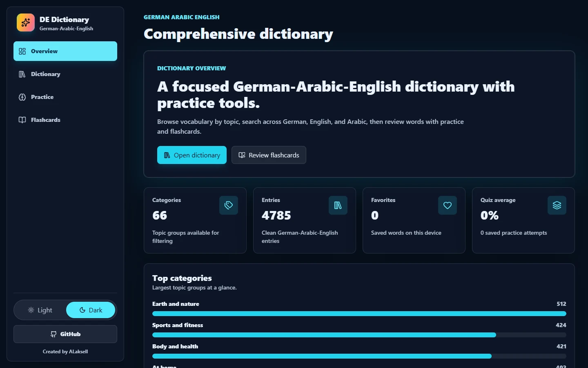

<div align="center">

# German-Arabic-English Dictionary

### A focused vocabulary dictionary and study companion for German learners.

Search German vocabulary with Arabic and English translations, then reinforce learning through practice rounds and flashcards.

[Source Code](https://github.com/ALaksell/German-Arabic-English-Dictionary) | [Author](https://github.com/ALaksell)

</div>



## About

German-Arabic-English Dictionary is a browser-based learning tool for people studying German with Arabic and English as reference languages. It brings searchable vocabulary, topic filters, short practice rounds, and flashcards into one responsive interface.

The dictionary includes **4,785** entries across **66** categories. Each record can include translations, grammar information, tags, and example sentences, helping learners move from discovery to review without leaving the app.

## Main features

- Search German, English, and Arabic vocabulary with typo-aware suggestions.
- Browse vocabulary by category and read focused word cards with available examples.
- Save favorites and mark learned words on the current device.
- Complete ten-question multiple-choice rounds in three translation directions.
- Review category-filtered vocabulary through animated reveal flashcards.
- Track recent quiz scores and learning activity in the overview.
- Choose a persistent light or dark interface theme.
- Use the application across mobile, tablet, and desktop layouts.

## Main sections

| Module | Purpose |
| --- | --- |
| **Overview** | Displays vocabulary totals, saved activity, quiz history, and the largest topic groups. |
| **Dictionary** | Searches and filters the German-Arabic-English vocabulary collection. |
| **Practice** | Runs scored, ten-question multiple-choice vocabulary rounds. |
| **Flashcards** | Reveals translations and moves through a category-specific study deck. |

## Programming languages

- TypeScript
- JavaScript
- CSS
- HTML

## Technology stack

| Area | Technology |
| --- | --- |
| Interface | React 19, React Router |
| Styling | Tailwind CSS, PostCSS |
| State | Zustand with browser persistence |
| Search and interaction | Fuse.js, Framer Motion, Lucide React |
| Build and quality | Vite, TypeScript, ESLint |
| Deployment configuration | Vercel |

## Run locally

### Prerequisites

- Node.js **20.19.0** or later
- npm

### Install and start

```bash
git clone https://github.com/ALaksell/German-Arabic-English-Dictionary.git
cd German-Arabic-English-Dictionary
npm install
npm run dev
```

The development server is configured for `127.0.0.1`.

## Configuration

No runtime environment variables are required for normal local use.

The vocabulary data is stored in the repository:

- `src/features/dictionary/data/words.json` contains the dictionary entries.
- `src/features/dictionary/data/meta.json` contains entry totals and category metadata.

For optional data maintenance, applying a reviewed Arabic translation file requires the `ARABIC_REVIEW_FILE` environment variable. It is not needed to run the application.

```bash
npm run data:prepare
npm run data:apply-arabic-review
```

## Production

Create the static production build:

```bash
npm run build
```

The generated files are written to `build/`. Preview the production build locally with:

```bash
npm run preview
```

The included Vercel configuration uses `npm install`, `npm run build`, and the `build/` output directory.

## Quality checks

```bash
npm run lint
npm run build
```

## Contact

Created by [ALaksell](https://github.com/ALaksell). The repository does not currently provide a public live-demo URL or a license file.
